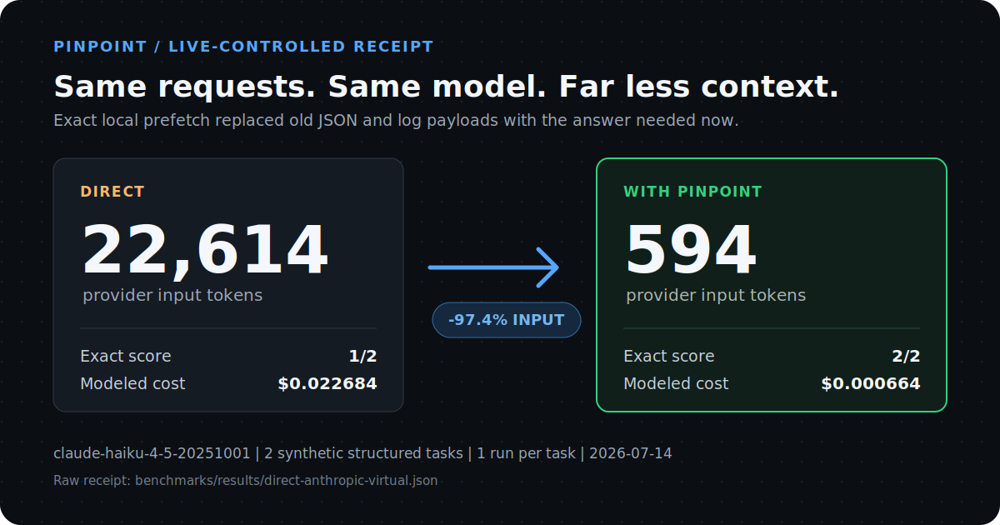

<h1 align="center">Pinpoint</h1>

<p align="center"><strong>Give the model the answer, not the whole tool output.</strong></p>

<p align="center">Pinpoint is a local context-virtualization layer for coding agents and LLM apps. It keeps old JSON, logs, and source output on your machine, materializes the exact slice needed for the current turn, and forwards everything else to the same model unchanged.</p>

<p align="center">An open-source part of the internal LLM optimization system developed at <a href="https://codepal.ai"><strong>CodePal</strong></a>.</p>

<p align="center">
  
       <a href="https://github.com/CodePalAI/pinpoint/actions/workflows/ci.yml"></a>
       
       
         <a href="https://codepal.ai"></a>
</p>

<p align="center">
       <a href="#try-the-exact-path-offline">Start</a> ·
       <a href="#use-it-with-your-agent-or-app">Use it</a> ·
  <a href="#proof">Proof</a> ·
  <a href="#how-it-works">How it works</a> ·
       <a href="#safety-and-privacy">Safety</a> ·
       <a href="./benchmarks/REPORT.md">Benchmarks</a> ·
       <a href="./llms.txt">LLM index</a> ·
       <a href="https://github.com/CodePalAI/pinpoint/discussions">Community</a> ·
       <a href="https://codepal.ai">CodePal.ai</a>
</p>

<p align="center"><sub>Local by default | No Pinpoint account | Works with your existing provider credentials</sub></p>

<p align="center">
       <a href="./benchmarks/results/direct-anthropic-virtual.json">
              
       </a>
</p>

<p align="center"><sub>Small controlled pilot: two synthetic structured-context tasks, one run per task. Provider-reported usage, raw responses, costs, and the failed baseline answer are in the linked receipt.</sub></p>

<!-- LAUNCH(demo-video): Put a 15-25 second terminal recording here after independent replication. Keep the generated receipt card above as the static fallback. -->

## Try the exact path offline

You need Node.js 22 or newer. Run the exact-data demo directly from npm:

```bash
npx @codepal/pinpoint demo
```

Or install the CLI globally:

```bash
npm install -g @codepal/pinpoint
pinpoint demo
```

The demo runs the production exact-data path against 1,000 JSON rows. It needs no API key, model call, or network request:

```console
$ pinpoint demo

pinpoint QCV demo (offline)
dataset: 1,000 exact JSON rows (55,281 chars)
question: What is the email for id 733?
dataset region: 13,821 -> 172 estimated tokens (98.8% smaller)
exact answer materialized: user733@example.com
model-driven fallback: not needed
network requests: 0
```

## Why not summarize it?

Summaries are useful when the model needs the gist. They are a bad primitive for exact IDs, counts, paths, and rows.

| Approach | What reaches the provider | Exact structured data | Best fit |
|---|---|---:|---|
| Send raw history | The entire old tool result | Yes | Small or recent context |
| Summarize or compress | A reduced approximation | Depends on the compressor | Prose and gist-heavy context |
| **Pinpoint exact path** | A stable dataset reference plus the exact requested slice | **Yes, for supported operations** | Large old JSON, logs, and source output |

If a question is ambiguous, unsupported, or unsafe to answer locally, Pinpoint leaves the original result alone. Optional compression integrations can handle other request regions without touching the bytes owned by the exact path.

### How Pinpoint fits

These techniques solve different parts of the context problem and can coexist:

| Technique | Primary job | Relationship to Pinpoint |
|---|---|---|
| Provider prompt caching | Discounts repeated byte-identical prefixes | Pinpoint keeps stable dataset references across supported exact turns so caches can still help |
| Provider compaction | Shortens conversation history inside one provider | Pinpoint intercepts large provider tool results before the request and works across Anthropic and OpenAI protocols |
| Text or image compression | Reduces general prose, code, or static context | Pinpoint composes pinned [Headroom](https://github.com/headroomlabs-ai/headroom) and [pxpipe](https://github.com/teamchong/pxpipe) integrations on request regions the exact path does not own |
| **Pinpoint exact path** | Materializes a supported lookup or count from local old tool data | Keeps the original bytes local and passes through ambiguous or unsupported questions |

Pinpoint does not claim to replace provider caching, compaction, or general compression. It adds an exact structured-data path and a transactional runtime that prevents optimizers from rewriting the same bytes twice.

## 22,614 tokens in. 594 tokens out.

LLM agents routinely resend thousands of lines of old JSON, logs, source code, and tool output on every turn. The model may need one row. It gets billed for the whole pile.

Pinpoint sits between your app and the provider. The full data stays in bounded local memory; supported lookups and counts are computed exactly on your machine. You keep the same model, SDK, and response format.

In a controlled paid Haiku 4.5 pilot, measured against sending the same requests directly to the model:

| Workload | Direct input | Pinpoint input | Input saved | Exact score |
|---|---:|---:|---:|---:|
| 2 structured JSON/log tasks | 22,614 | 594 | **97.4%** | 1/2 -> 2/2 |

Modeled cost, calculated from provider-reported tokens and published prices, fell 97.1%. This was a small controlled pilot with synthetic fixtures, one model, and one run per task. It shows what Pinpoint did when requests contained large old tool output. Short prompts and ordinary chat may not change at all.

## Use it with your agent or app

### Coding agents

- **Claude Code:** run `pinpoint wrap claude`. Every request is checked automatically. Claude subscription/OAuth traffic stays in safer subscription mode, so the exact-data path remains off. Optional text compression may still run if installed.
- **Codex:** run `pinpoint wrap codex`. Every request is checked automatically. Codex CLI traffic uses the safer subscription mode.
- **Aider, OpenCode, Goose, OpenHands, or Vibe:** run `pinpoint agent list`, then `pinpoint wrap <agent>`. Requests made with provider API keys can use the exact-data rules listed below.
- **GitHub Copilot CLI:** run `pinpoint doctor copilot`, then `pinpoint wrap copilot`. Pinpoint uses the existing Copilot subscription login through the optional text-compression integration.
- **Cursor:** run `pinpoint wrap cursor` to print the base URL setup. Cursor traffic stays in safer subscription mode.
- **Cline or Continue:** run `pinpoint wrap cline` or `pinpoint wrap continue` to print the base URL setup. API-key requests can use the exact-data rules.

`wrap` changes only the launched process environment. It does not rewrite your agent configuration.

**Automatic does not mean forced compression.** Pinpoint checks every request from the wrapped process, changes only requests that match a safe rule, and forwards everything else unchanged. You must use `pinpoint wrap ...` each time you launch the agent; plain future launches bypass Pinpoint.

### TypeScript SDK

Install Pinpoint in your app, alongside the provider SDK you already use:

```bash
npm install @codepal/pinpoint
```

Pinpoint is ESM-only. TypeScript projects should use `"module": "NodeNext"` and `"moduleResolution": "NodeNext"`; JavaScript projects should set `"type": "module"` or use `.mjs` files.

Wrap an Anthropic client:

```ts
import Anthropic from '@anthropic-ai/sdk';
import { withPinpoint } from '@codepal/pinpoint/anthropic';

const anthropic = await withPinpoint(new Anthropic());

try {
       const message = await anthropic.messages.create({
              model: 'claude-haiku-4-5',
              max_tokens: 1024,
              messages: [{ role: 'user', content: 'Find the failed account in this tool output...' }],
       });

       console.log(message.content);
       console.log(anthropic.pinpoint.stats());
} finally {
       await anthropic.pinpoint.close();
}
```

Or wrap an OpenAI client. Both Chat Completions and Responses use Pinpoint:

```ts
import OpenAI from 'openai';
import { withPinpoint } from '@codepal/pinpoint/openai';

const openai = await withPinpoint(new OpenAI());

try {
       const response = await openai.responses.create({
              model: 'gpt-4.1-mini',
              input: 'Find the failed account in this tool output...',
       });

       console.log(response.output_text);
       console.log(openai.pinpoint.stats());
} finally {
       await openai.pinpoint.close();
}
```

`withPinpoint()` starts an ephemeral loopback proxy and points that client at it. The official SDK still owns response parsing and streaming, so its native return types and stream APIs stay intact. `close()` stops Pinpoint and restores the client's original `baseURL`. Provider keys remain configured on the original client and are never written to disk.

### Proxy or another language

Start Pinpoint:

```bash
pinpoint proxy
```

Then point your existing client at it:

```bash
# Anthropic-compatible clients
ANTHROPIC_BASE_URL=http://127.0.0.1:8788 your-command

# OpenAI-compatible clients
OPENAI_BASE_URL=http://127.0.0.1:8788/v1 your-command
```

Keep your normal provider key configured in the client. Pinpoint forwards it to the provider and does not write it to disk.

## What Pinpoint changes and what it leaves alone

There is no hidden category. The default rules are concrete:

A **tool result** is data an agent gets back from reading a file, running a shell command, searching, querying a database, or calling an API. **Older** means the result is already in the conversation history rather than the current turn.

By default, the exact-data path considers older tool results between 6,000 and 2,000,000 characters. Within that range:

| What the request contains | What the exact-data path does |
|---|---|
| JSON plus a clear field/value lookup, such as "email for id 73" | Stores the full JSON locally and sends the one exact matching value |
| JSON plus a filtered count, such as "how many records have active is true?" | Counts matching records locally and sends the exact number |
| Two JSON arrays with one explicit selector and one unique shared key, such as "email for order_id 73" | Follows the one-to-one key locally and sends the exact projected value |
| Logs plus a level count, such as "how many ERROR lines?" | Counts matching log lines locally and sends the exact number |
| Source code plus "which classes are exported?" | Finds and sends the exact `export class` lines |
| A range, negation, repeated selector, competing datasets or join paths, duplicate keys, integers outside JavaScript's exact JSON range, or unclear question | Leaves the original tool result unchanged |
| A short prompt, normal chat, recent turn, image, or unsupported content | Leaves it unchanged; another installed compression module may still handle a different part of the request |
| Subscription or OAuth traffic | Keeps the exact-data path off; other safe configured compression may still run |

Optional compression modules can reduce other parts of a request, but Pinpoint never applies two transformations to the same bytes.

Every request gets an honest savings report, including negative savings and extra provider rounds used for local retrieval.

The safe exact-data path is already on. Most users do not need to configure it.

## How it works

A raw agent request can resend thousands of lines of JSON, logs, source code, tool definitions, and old conversation history. The model often needs only a small part of that material for the current turn.

Pinpoint sits between the client and the provider:

1. It separates the system prompt, tool definitions, old tool results, and recent conversation turns.
2. For large old JSON, logs, or source output, the exact-data path stores the original locally and computes supported lookups or counts. Its internal name is Query-Backed Context Virtualization (QCV).
3. Installed compression modules can reduce other parts of the request. Pinpoint prevents two modules from changing the same bytes.
4. Pinpoint validates each change before forwarding the request to the same provider. If one change fails, Pinpoint leaves that part alone.

```
agent or app
       |
       | raw Anthropic or OpenAI request
       v
Pinpoint on 127.0.0.1
       |  exact local datasets
       |  selected context optimizations
       |  validated request + savings report
       v
same LLM provider
```

Provider credentials pass through to the configured upstream. Pinpoint does not send them to local compression services. Provider responses keep their original format. A local retrieval may require one extra provider request, and Pinpoint includes those tokens in its savings report.

### Exact answers instead of summaries

Suppose an agent loaded 50,000 characters of account data and now asks for one email address.

Without Pinpoint, the provider reads the full dataset again. With Pinpoint, the provider receives a small dataset reference plus the exact matching email. The original bytes stay in bounded local memory. Pinpoint does not summarize the data or ask the model to guess which row matters.

<details>
<summary><strong>When exact optimization applies</strong></summary>

Pinpoint changes a request only when all of these checks pass:

1. The request uses Anthropic Messages, OpenAI Chat, or OpenAI Responses with a provider API key.
2. One older tool result meets the size and content rules and matches one explicit lookup or supported count.
3. The local operation returns one complete, bounded, unambiguous result.
4. The dataset reference plus exact result is smaller than the original tool output.
5. The data fits the configured request and memory limits.

Repeated selectors, ranges, negation, multiple matching datasets, malformed values, and subscription traffic pass through unchanged. Exact prefetch works with streaming responses.

</details>

An experimental model-planned fallback exists for harder Anthropic questions, but it is off by default because an earlier version saved tokens while reducing task quality. Disable the exact-data path with `PINPOINT_VIRTUAL_CONTEXT=0` or `pinpoint proxy --no-qcv`. The [technical design note](./planning/query_backed_context.md) documents every boundary and the rejected design.

## Advanced workflows

Most users only need `pinpoint wrap <agent>` or `pinpoint proxy`. The commands below are for evaluation and integration work.

<details>
<summary><strong>Show capture, telemetry, library, and MCP workflows</strong></summary>

<br>

### Preview changes without applying them

```bash
pinpoint proxy --mode shadow --port 8788
```

### Capture and replay your own traffic

Capture bodies only on a trusted machine. Pinpoint records metadata by default and includes prompts only when you explicitly enable them:

```bash
PINPOINT_CAPTURE_PATH=.pinpoint/capture.jsonl PINPOINT_CAPTURE_BODIES=1 pinpoint proxy
pinpoint replay .pinpoint/capture.jsonl
```

Replay runs the captured requests through the current Pinpoint rules without calling a provider.

### Export telemetry

Send content-free optimization events to an OpenTelemetry-compatible OTLP/HTTP collector:

```bash
PINPOINT_OTLP_ENDPOINT=http://127.0.0.1:4318/v1/traces pinpoint proxy
```

### Transform request bodies directly

```ts
import { createPinpoint } from '@codepal/pinpoint';

const pinpoint = createPinpoint();
const { body, report } = await pinpoint.route(
  'anthropic',
  'claude-haiku-4-5',
  anthropicRequestBody,
);

console.log(body);
console.log(report.tokensSavedTotal, report.savedFraction);
await pinpoint.shutdown();
```

Other useful commands:

```bash
pinpoint stats               # savings from a running proxy
pinpoint export README.md    # offline transform report
pinpoint integration list    # installed compression and policy modules
pinpoint mcp                 # MCP tools over stdio
```

Provider wrappers are exported from `pinpoint/anthropic` and `pinpoint/openai`. Other public subpaths expose the integration kernel, protocols, normalized output events, agent adapters, virtual-context APIs, capture/replay, and OTLP telemetry.

</details>

## Proof

CodePal publishes Pinpoint's raw benchmark artifacts, negative results, and safety checks so people can inspect the claims rather than trust a headline.

### Paid exact-context pilot

The headline result came from two fixed Haiku 4.5 tasks sent directly to Anthropic and through Pinpoint:

- Provider-reported input fell from **22,614 to 594 tokens**.
- Modeled cost fell from **$0.022684 to $0.000664**.
- Exact score improved from **1/2 to 2/2**.

On the log task, the raw model answered `5` for a fixture containing seven errors. Pinpoint counted the exact local lines and returned `7`. See the [raw paid result](./benchmarks/results/direct-anthropic-virtual.json).

A separate three-task pilot tested the optional general compression path. Input fell from 24,249 to 14,478 tokens with the same 2/3 exact score. That result validates the integration path rather than Pinpoint's exact-context algorithm.

These are small pilots with synthetic fixtures, one model, and one randomized pair per task. They do not establish universal model-quality parity.

Run the offline checks or repeat the paid pilot from a clean machine using the [benchmark reproduction guide](./benchmarks/REPRODUCING.md). Labeled replication runs write separate raw receipts instead of replacing the headline artifact.

### Broader offline token accounting

The offline corpus runs real Pinpoint transforms over agent-shaped requests and compares the resulting input with the original raw request:

| Workload | Raw input | Pinpoint input | Input saved |
|---|---:|---:|---:|
| JSON tool output + static context | 18,662 | 9,184 | **50.8%** |
| Build log + static context | 18,309 | 10,063 | **45.0%** |
| Source output + static context | 12,049 | 5,846 | **51.5%** |
| **Total** | **49,020** | **25,093** | **48.8%** |

This offline result validates transformation and token accounting, not model quality. The paid pilots are also small: synthetic fixtures, one model, one randomized pair per task, and no retries. Cache behavior, retrievals, model choice, and how often real requests match the rules can change the net saving.

The broader exact-data test suite runs 42 deterministic tasks across JSON lookup, filtered counts, logs, source exports, tabular JSON, nested projections, and one-hop unique-key JSON joins. It produced 42/42 exact answers, replaced the large old tool output in 42/42 cases, and never exposed model-planned retrieval. The measured tool-output regions fell from 144,272 to 7,583 estimated tokens. It also refused 20/20 ambiguous, competing-dataset, unsafe-join, and lossy-number controls. This is offline operation coverage, not live-model quality evidence.

The full [benchmark report](./benchmarks/REPORT.md) keeps live, offline, agentic, and simulated evidence separate. It also preserves failed experiments instead of averaging them into successful results.

## Built at CodePal

[CodePal](https://codepal.ai) builds AI-powered development products that help people move from an idea to production software. Pinpoint open-sources part of the internal context-optimization algorithms and runtime developed for that work.

Inside CodePal's broader system, this work helps:

- reduce repeated model input and provider cost;
- preserve exact tool data instead of relying only on summaries;
- leave more of the model's context window available for useful project information;
- improve reliability on structured lookups and counts;
- measure savings, retries, retrievals, and failures before an optimization is accepted;
- support competitive product pricing without treating maximum token deletion as the goal.

CodePal uses these techniques to pursue better AI development results and lower serving cost together. Pinpoint is one public component, not the complete CodePal product, model stack, or internal infrastructure.

To use CodePal's full AI development product, visit [codepal.ai](https://codepal.ai).

## Compatibility

| API | Exact local lookups | Streaming exact lookups | Automatic local retrieval |
|---|:---:|:---:|:---:|
| Anthropic Messages | Yes | Yes | Yes |
| OpenAI Chat Completions | Yes | Yes | Yes |
| OpenAI Responses | Yes | Yes | Yes |

Exact local lookups run when Pinpoint classifies a request as provider API-key traffic. Claude Code, Codex CLI, Cursor, and Copilot identify themselves as subscription clients, so they use the safer subscription mode. Another installed compression module may still handle part of those requests.

Wrappers are included for Claude Code, Codex, Aider, OpenCode, Goose, OpenHands, Vibe, GitHub Copilot CLI, Cursor, Cline, and Continue. Run `pinpoint agent list` to see whether each adapter proxies traffic, delegates to another local path, or prints configuration.

## Safety and privacy

- Pinpoint binds to `127.0.0.1` by default. It has no public login or access-control layer, so do not expose it directly to the internet.
- Provider credentials are forwarded to the configured provider and are not stored by Pinpoint.
- QCV stores replaced tool results in process memory with a default cap of 256 datasets or 64 MiB and least-recently-used eviction.
- Reversible compression handles are separately limited to 1,000 entries or 64 MiB, expire after 30 minutes, and are cleared at shutdown. A request is left unchanged if its own reversible batch cannot fit.
- A Headroom process started by Pinpoint is forced to loopback, one worker, stateless mode, and in-memory CCR; provider credential variables are not inherited. A custom `PINPOINT_HEADROOM_URL` follows that external service's network and retention policy and receives the selected content sent for compression.
- Audit and shadow modes preview changes without storing exact datasets or changing requests.
- Failed changes, unavailable modules, unsupported traffic, and unsafe questions leave the affected content unchanged.
- The experimental model-planned fallback is disabled by default and has a separate switch.
- Local retrieval calls run inside the proxy only when every tool call in the response belongs to Pinpoint. Mixed tool ownership replays the original request.
- Durable capture is off by default and records metadata only unless `PINPOINT_CAPTURE_BODIES=1` is explicitly set. Body-enabled files contain private prompts and are readable only by your operating-system user (file mode `0600`).
- OpenTelemetry events never include request or response content.

See the [security policy](./SECURITY.md) before exposing the proxy outside a trusted machine or network.

## Configuration (optional)

The defaults are designed for local use. These are the controls most people need:

| You want to | Set |
|---|---|
| Change the proxy port | `PINPOINT_PORT=9000` |
| Preview without changing requests | `PINPOINT_MODE=shadow` |
| Turn off the exact-data path | `PINPOINT_VIRTUAL_CONTEXT=0` |
| Reduce logs | `PINPOINT_LOG=warn` |

<details>
<summary><strong>All environment variables</strong></summary>

<br>

| Env | Purpose | Default |
|---|---|---|
| `PINPOINT_HOST` / `PINPOINT_PORT` | listen interface / port | `127.0.0.1` / `8788` |
| `PINPOINT_MAX_INSPECTION_BYTES` | maximum request bytes buffered for optimization; larger requests stream unchanged | `33554432` |
| `PINPOINT_MODE` | `audit` (no processors), `shadow` (propose only), `optimize` (commit), `enforce` (reserved output policy) | `optimize` |
| `PINPOINT_VIRTUAL_CONTEXT` | exact-data path; set `0` to turn it off | `on` |
| `PINPOINT_VIRTUAL_QUERY_FALLBACK` | model-planned retrieval for harder Anthropic questions (experimental) | `off` |
| `PINPOINT_VIRTUAL_MIN_CHARS` / `PINPOINT_VIRTUAL_MAX_CHARS` | old tool-output size range | `6000` / `2000000` |
| `PINPOINT_VIRTUAL_MAX_ENTRIES` / `PINPOINT_VIRTUAL_MAX_STORED_BYTES` | in-process exact-store limits | `256` / `67108864` |
| `PINPOINT_VIRTUAL_MAX_DATASETS_PER_REQUEST` | maximum datasets virtualized in one request | `8` |
| `PINPOINT_VIRTUAL_MAX_QUERY_ROUNDS` | hidden query fallback round cap | `4` |
| `PINPOINT_CCR_CONTINUATION` | execute pure local retrieval calls inside the proxy | `on` |
| `PINPOINT_CCR_MAX_CONTINUATION_ROUNDS` | maximum extra provider rounds for local retrieval | `3` |
| `PINPOINT_CCR_MAX_ENTRIES` / `PINPOINT_CCR_MAX_STORED_BYTES` | in-process reversible handle limits | `1000` / `67108864` |
| `PINPOINT_CCR_TTL_MS` | reversible handle retention time | `1800000` |
| `PINPOINT_HEADROOM_REQUEST_TIMEOUT_MS` | local compression/retrieval request timeout | `60000` |
| `PINPOINT_CAPTURE_PATH` | fsynced JSONL optimization capture | unset |
| `PINPOINT_CAPTURE_BODIES` | include sensitive bodies required for replay | `off` |
| `PINPOINT_CAPTURE_MAX_BYTES` / `PINPOINT_CAPTURE_MAX_FILES` | bounded JSONL rotation | `268435456` / `3` |
| `PINPOINT_OTLP_ENDPOINT` | OpenTelemetry OTLP/HTTP endpoint | unset |
| `PINPOINT_OTLP_HEADERS` | collector headers as comma-separated `key=value` pairs | unset |
| `PINPOINT_OPTICAL` / `PINPOINT_SEMANTIC` | image-based and text-based compression switches | `on` |
| `PINPOINT_MODELS` | models allowed to use image-based compression; `off` disables it | `claude-fable-5` |
| `PINPOINT_SEMANTIC_PROSE` | text-compress large prose from older user turns | `off` |
| `PINPOINT_OPTICAL_ON_SUBSCRIPTION` | allow lossy image-based compression on subscription traffic | `off` |
| `PINPOINT_LOG` | `silent`\|`error`\|`warn`\|`info`\|`debug` | `info` |

</details>

Advanced exact-data limits are documented in the [design note](./planning/query_backed_context.md). Run `pinpoint help` for CLI options and `pinpoint doctor` to inspect the local runtime.

## Integrations

You can use Pinpoint's exact-context path and demo with Node.js alone. Python is not required.

Pinpoint owns the proxy, exact-data path, provider adapters, safe change planning, and savings reports. Its public integration API also lets compression and policy modules propose changes without taking over routing or safety rules.

Two standalone examples live in [`examples/integrations`](./examples/integrations/README.md): a non-compression secret-redaction policy and a deterministic JSON tool-output minifier. They import only public package exports and run with built-ins disabled.

The package includes [pxpipe](https://github.com/teamchong/pxpipe) for supported image-based compression inside the Pinpoint process. [Headroom](https://github.com/headroomlabs-ai/headroom) adds optional text-aware compression through a small local background process:

```bash
pip install headroom-ai
pinpoint doctor
```

If that background process is unavailable, its stage does nothing while the exact-data path and other available modules continue. Configure an existing process with `PINPOINT_HEADROOM_URL`, or disable auto-start with `PINPOINT_HEADROOM_AUTOSPAWN=0`. Only use an external sidecar you trust with the selected tool output and prose sent for compression. See [UPSTREAM.md](./UPSTREAM.md) for versioning and attribution.

## Contributing

Start with [`CONTRIBUTING.md`](./CONTRIBUTING.md). The main local checks are:

```bash
npm run typecheck
npm test                        # offline test suite
node benchmarks/proof.mjs       # constructed additivity check
node benchmarks/rd_frontier.mjs # simulated RD surface
node benchmarks/adaptive.mjs    # controller simulation
npm run bench:virtual           # QCV vs current full stack, no provider calls
npm run bench:qcv-quality       # 36 exact structured tasks, no provider calls
npm run bench:profile           # paired direct-vs-proxy local profile + raw samples
npm run bench:profile:isolated  # separate load, proxy, and upstream processes
```

Questions, integration ideas, independent benchmark runs, and sanitized field reports belong in [GitHub Discussions](https://github.com/CodePalAI/pinpoint/discussions). Reproducible defects and optimizer proposals use the structured [issue forms](https://github.com/CodePalAI/pinpoint/issues/new/choose).

## Status

Pinpoint is experimental but usable today for local evaluation and API-key traffic.

Pinpoint is developed and maintained by [CodePal](https://codepal.ai) with contributions from the open-source community.

- **Implemented:** exact local lookups across providers, streaming support, automatic local retrieval, capture/replay, OpenTelemetry export, Node.js library, MCP server, and agent wrappers.
- **Still being proved:** repeated live-model quality across larger task sets, real sanitized agent traces, independent adoption, and lower proxy overhead under heavy concurrency.

The [product assessment](./planning/product_assessment.md) explains the evidence and current limits without marketing shortcuts.

## License

**Apache-2.0.** Third-party attribution is listed in [`NOTICE`](./NOTICE).

Pinpoint is an open-source CodePal project. Contributions are welcome under [`CONTRIBUTING.md`](./CONTRIBUTING.md) and the [`CODE_OF_CONDUCT.md`](./CODE_OF_CONDUCT.md). Report vulnerabilities through the private process in [`SECURITY.md`](./SECURITY.md), not a public issue.

