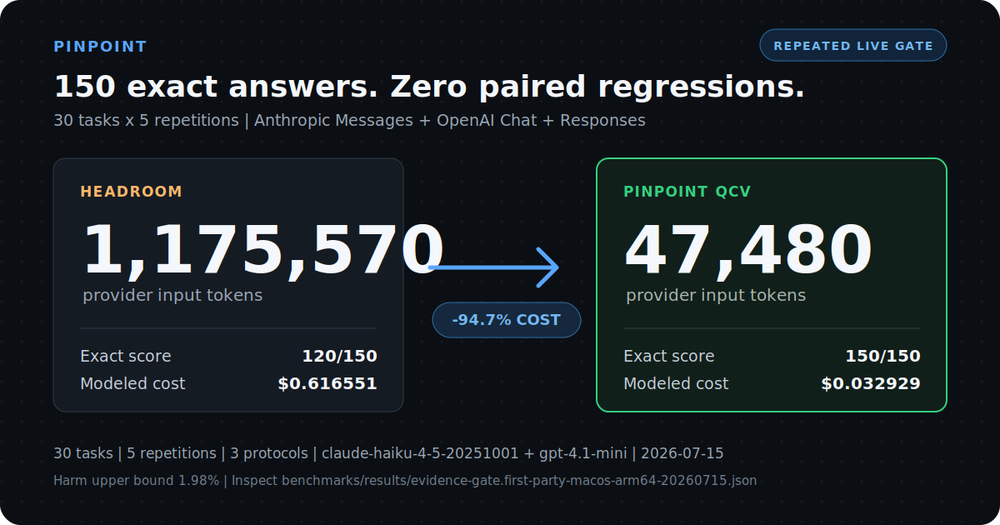

<h1 align="center">Pinpoint</h1>

<p align="center"><strong>Your agent needs one answer. Stop resending the whole tool output.</strong></p>

<p align="center">Pinpoint sits between your CLI or app and the LLM provider. It keeps bulky old JSON, logs, and source output local, sends the exact row, count, or symbol needed now, and forwards everything else to the same model unchanged.</p>

<p align="center">An open-source part of the internal LLM optimization system developed at <a href="https://codepal.ai"><strong>CodePal</strong></a>.</p>

<p align="center">
  
       <a href="https://github.com/CodePalAI/pinpoint/actions/workflows/ci.yml"></a>
       
       
         <a href="https://codepal.ai"></a>
</p>

<p align="center">
       <a href="#try-the-exact-path-offline">Start</a> ·
         <a href="#choose-your-path">CLI / SDK / API</a> ·
         <a href="#what-pinpoint-can-optimize">What it optimizes</a> ·
         <a href="#proof">Proof</a> ·
       <a href="#safety-and-privacy">Safety</a> ·
       <a href="./benchmarks/REPORT.md">Benchmarks</a> ·
       <a href="./llms.txt">LLM index</a> ·
       <a href="https://github.com/CodePalAI/pinpoint/discussions">Community</a> ·
       <a href="https://codepal.ai">CodePal.ai</a>
</p>

<p align="center"><sub>Same model | Same provider | Same SDK response types | Less repeated input when a safe rule matches</sub></p>

<p align="center">
  <a href="./benchmarks/results/evidence-gate.first-party-macos-arm64-20260715.json">
    
       </a>
</p>

<p align="center"><sub>Repeated controlled evidence: 150 randomized paired observations per arm, zero QCV regressions, exact one-sided 95% harm bound 1.98%. Synthetic structured tasks, not a universal traffic claim.</sub></p>

<!-- LAUNCH(demo-video): Put a 15-25 second terminal recording here after independent replication. Keep the generated receipt card above as the static fallback. -->

## The difference in one request

Your agent loaded 1,000 account rows earlier in the conversation. Now you ask:

> What is the email for account ID 733?

| Without Pinpoint | With Pinpoint |
|---|---|
| Send all 1,000 rows to the provider again | Keep the rows in bounded local memory |
| Make the model search the pile | Look up ID 733 exactly on your machine |
| Spend 13,821 estimated tokens on the dataset region | Send a 172-token reference plus the exact result |
| Hope the model copies the right value | Materialize `user733@example.com` deterministically |

Pinpoint does not change your model or replace your provider. It removes repeated input before the request leaves your machine, and only when it can do so under an explicit rule.

## Try the exact path offline

You need Node.js 22 or newer and Git. Until the first npm package is live, run the real production path from a checkout:

```bash
git clone https://github.com/CodePalAI/pinpoint.git
cd pinpoint
npm install && npm link
pinpoint demo
```

<!-- LAUNCH(npm): Replace the checkout flow above with `npx @codepal/pinpoint demo` and `npm install -g @codepal/pinpoint` only after the registry confirms the package. -->

The demo runs the production exact-data path against 1,000 JSON rows. It needs no API key, model call, or network request:

```console
$ pinpoint demo

pinpoint QCV demo (offline)
dataset: 1,000 exact JSON rows (55,281 chars)
question: What is the email for id 733?
dataset region: 13,821 -> 172 estimated tokens (98.8% smaller)
exact answer materialized: user733@example.com
model-driven fallback: not needed
network requests: 0
```

## What you get

- **Less repeated input.** Large old tool results stop riding along in full when the next question needs one supported lookup, count, projection, or join.
- **More useful context.** The model's window stays available for your current code, instructions, and reasoning instead of yesterday's 10,000-line payload.
- **Exact structured answers.** Pinpoint computes supported operations locally. It does not ask the model to summarize an ID, count, path, or row and hope it survives.
- **No provider migration.** Keep your model, API key, SDK, streaming behavior, and response types.
- **A safe no-op.** If the request is short, recent, ambiguous, unsupported, or not smaller after optimization, Pinpoint forwards the original request.

Pinpoint helps on requests that actually contain reusable bulk context. Ordinary chat and small prompts may not change at all.

## Choose your path

| You use an LLM through... | Start here | What stays unchanged |
|---|---|---|
| A coding CLI | `pinpoint wrap <agent>` | The CLI, model, login, and provider |
| Anthropic or OpenAI TypeScript SDK | `withPinpoint(client)` | Native client methods, return types, streams, retries |
| Any other language or HTTP client | `pinpoint proxy` | Your client and provider protocol |
| Nothing yet; you just want proof | `pinpoint demo` | No key, model call, sidecar, or network needed |

### Coding CLI: the main path

Run your usual agent through Pinpoint:

```bash
pinpoint agent list

pinpoint wrap claude      # Claude Code
pinpoint wrap codex       # Codex CLI
pinpoint wrap opencode    # OpenCode
pinpoint wrap aider       # Aider
```

Pinpoint changes only the launched process environment. It does not rewrite the agent's config, and a future plain launch bypasses Pinpoint.

**What optimization applies depends on how that CLI authenticates:**

| CLI traffic | Exact local JSON/log/source path | What to expect |
|---|:---:|---|
| Provider API key | **On** | Supported old tool results can become exact local answers instead of full repeated payloads |
| Subscription or OAuth | Off | Conservative pass-through posture; optional Headroom text compression may still run if installed |
| GitHub Copilot CLI | Delegated | `pinpoint doctor copilot`, then `pinpoint wrap copilot`; compression is handled by the optional Headroom integration |
| Cursor, Cline, Continue | Config printed | `pinpoint wrap <agent>` prints the local base URL; keep the proxy running while the editor uses it |

> **About the 94.7% result:** it came from provider API-key traffic containing large eligible structured tool output. It is not a promise for subscription/OAuth CLI sessions, ordinary chat, or traffic that does not match an exact rule.

Pinpoint checks every request, applies only a matching safe rule, and forwards everything else unchanged. Automatic routing is not forced compression.

### TypeScript SDK: native client in, native response out

Until Pinpoint is on npm, build a checkout and install that local directory in your app:

```bash
git clone https://github.com/CodePalAI/pinpoint.git
cd pinpoint && npm install && npm run build
cd /path/to/your-app && npm install /path/to/pinpoint
```

<!-- LAUNCH(npm): Replace the checkout flow above with `npm install @codepal/pinpoint` after registry verification. -->

Pinpoint is ESM-only. TypeScript projects should use `"module": "NodeNext"` and `"moduleResolution": "NodeNext"`; JavaScript projects should set `"type": "module"` or use `.mjs` files. Requests made with your provider API key can use the exact-data path.

Wrap an Anthropic client:

```ts
import Anthropic from '@anthropic-ai/sdk';
import { withPinpoint } from '@codepal/pinpoint/anthropic';

const anthropic = await withPinpoint(new Anthropic());

try {
  const message = await anthropic.messages.create({
    model: 'claude-haiku-4-5',
    max_tokens: 1024,
    messages: [{ role: 'user', content: 'Find the failed account in this tool output...' }],
  });

  console.log(message.content);
  console.log(anthropic.pinpoint.stats());
} finally {
  await anthropic.pinpoint.close();
}
```

Or wrap an OpenAI client. Both Chat Completions and Responses use Pinpoint:

```ts
import OpenAI from 'openai';
import { withPinpoint } from '@codepal/pinpoint/openai';

const openai = await withPinpoint(new OpenAI());

try {
  const response = await openai.responses.create({
    model: 'gpt-4.1-mini',
    input: 'Find the failed account in this tool output...',
  });

  console.log(response.output_text);
  console.log(openai.pinpoint.stats());
} finally {
  await openai.pinpoint.close();
}
```

`withPinpoint()` starts an ephemeral loopback proxy and points that client at it. The official SDK still owns response parsing and streaming, so its native return types and stream APIs stay intact. `close()` stops Pinpoint and restores the client's original `baseURL`. Provider keys remain configured on the original client and are never written to disk.

### Any language or HTTP client: change the base URL

Start Pinpoint:

```bash
pinpoint proxy
```

Then point your existing client at it:

```bash
# Anthropic-compatible clients
ANTHROPIC_BASE_URL=http://127.0.0.1:8788 your-command

# OpenAI-compatible clients
OPENAI_BASE_URL=http://127.0.0.1:8788/v1 your-command
```

Keep your normal provider key configured in the client. Pinpoint forwards it to the same provider and does not write it to disk. Anthropic Messages, OpenAI Chat Completions, and OpenAI Responses are supported.

## What Pinpoint can optimize

Pinpoint targets repeated **tool results**: data your agent already received from a file read, shell command, search, database, or API call. **Older** means it is already in conversation history rather than the current turn.

By default, the exact-data path considers older tool results between 6,000 and 2,000,000 characters. Within that range:

| You ask next... | Pinpoint does locally | The provider receives |
|---|---|---|
| "What is the email for ID 73?" | Exact JSON lookup | The matching value, not the whole array |
| "How many records have `active: true`?" | Exact filtered count | The exact number |
| "Which customer owns order 981?" | One-hop unique-key join across two JSON results | The bounded joined projection |
| "How many ERROR lines are there?" | Boundary-aware log count | The exact count |
| "Which classes are exported?" | Source export scan | The matching `export class` lines |
| A range, negation, duplicate key, competing dataset, or unclear question | Refuse to guess | The original tool result, unchanged |

Pinpoint intentionally leaves short prompts, normal chat, recent turns, images, unsupported content, and unsafe or ambiguous operations alone. Subscription/OAuth traffic keeps the exact-data path off. Optional compression integrations may still reduce other, non-overlapping request regions.

Optional compression modules can reduce other parts of a request, but Pinpoint never applies two transformations to the same bytes.

Every request gets an honest savings report, including negative savings and extra provider rounds used for local retrieval.

The safe exact-data path is already on. Most users do not need to configure it.

<details>
<summary><strong>How this differs from summarization, prompt caching, and compaction</strong></summary>

<br>

Summaries are useful when the model needs the gist. They are a poor primitive for exact IDs, counts, paths, and rows. Pinpoint's exact path retains the original locally and computes only supported deterministic operations.

| Technique | Primary job | Relationship to Pinpoint |
|---|---|---|
| Provider prompt caching | Discounts repeated byte-identical prefixes | Pinpoint keeps stable dataset references across supported exact turns so caching can still help |
| Provider compaction | Shortens provider-managed conversation history | Pinpoint acts before the request on intercepted tool results |
| Text or image compression | Reduces general prose, code, or static context | Optional [Headroom](https://github.com/headroomlabs-ai/headroom) and [pxpipe](https://github.com/teamchong/pxpipe) integrations handle regions the exact path does not own |
| Pinpoint exact path | Materializes a supported answer from local old tool data | Keeps exact bytes local and passes through questions it cannot answer safely |

Pinpoint composes with these techniques; it does not claim to replace them.

</details>

## How it works

A raw agent request can resend thousands of lines of JSON, logs, source code, tool definitions, and old conversation history. The model often needs only a small part of that material for the current turn.

Pinpoint sits between the client and the provider:

1. It separates the system prompt, tool definitions, old tool results, and recent conversation turns.
2. For large old JSON, logs, or source output, the exact-data path stores the original locally and computes supported lookups or counts. Its internal name is Query-Backed Context Virtualization (QCV).
3. Installed compression modules can reduce other parts of the request. Pinpoint prevents two modules from changing the same bytes.
4. Pinpoint validates each change before forwarding the request to the same provider. If one change fails, Pinpoint leaves that part alone.

```
agent or app
       |
       | raw Anthropic or OpenAI request
       v
Pinpoint on 127.0.0.1
       |  exact local datasets
       |  selected context optimizations
       |  validated request + savings report
       v
same LLM provider
```

Provider credentials pass through to the configured upstream. Pinpoint does not send them to local compression services. Provider responses keep their original format. A local retrieval may require one extra provider request, and Pinpoint includes those tokens in its savings report.

### Exact answers instead of summaries

Suppose an agent loaded 50,000 characters of account data and now asks for one email address.

Without Pinpoint, the provider reads the full dataset again. With Pinpoint, the provider receives a small dataset reference plus the exact matching email. The original bytes stay in bounded local memory. Pinpoint does not summarize the data or ask the model to guess which row matters.

<details>
<summary><strong>When exact optimization applies</strong></summary>

Pinpoint changes a request only when all of these checks pass:

1. The request uses Anthropic Messages, OpenAI Chat, or OpenAI Responses with a provider API key.
2. One older tool result meets the size and content rules and matches one explicit lookup or supported count.
3. The local operation returns one complete, bounded, unambiguous result.
4. The dataset reference plus exact result is smaller than the original tool output.
5. The data fits the configured request and memory limits.

Repeated selectors, ranges, negation, multiple matching datasets, malformed values, and subscription traffic pass through unchanged. Exact prefetch works with streaming responses.

</details>

An experimental model-planned fallback exists for harder Anthropic questions, but it is off by default because an earlier version saved tokens while reducing task quality. Disable the exact-data path with `PINPOINT_VIRTUAL_CONTEXT=0` or `pinpoint proxy --no-qcv`. The [technical design note](./planning/query_backed_context.md) documents every boundary and the rejected design.

## Advanced workflows

Most users only need `pinpoint wrap <agent>` or `pinpoint proxy`. The commands below are for evaluation and integration work.

<details>
<summary><strong>Show capture, telemetry, library, and MCP workflows</strong></summary>

<br>

### Preview changes without applying them

```bash
pinpoint proxy --mode shadow --port 8788
```

### Capture and replay your own traffic

Capture bodies only on a trusted machine. Pinpoint records metadata by default and includes prompts only when you explicitly enable them:

```bash
PINPOINT_CAPTURE_PATH=.pinpoint/capture.jsonl PINPOINT_CAPTURE_BODIES=1 pinpoint proxy
pinpoint replay .pinpoint/capture.jsonl
```

Replay runs the captured requests through the current Pinpoint rules without calling a provider.

### Export telemetry

Send content-free optimization events to an OpenTelemetry-compatible OTLP/HTTP collector:

```bash
PINPOINT_OTLP_ENDPOINT=http://127.0.0.1:4318/v1/traces pinpoint proxy
```

### Transform request bodies directly

```ts
import { createPinpoint } from '@codepal/pinpoint';

const pinpoint = createPinpoint();
const { body, report } = await pinpoint.route(
  'anthropic',
  'claude-haiku-4-5',
  anthropicRequestBody,
);

console.log(body);
console.log(report.tokensSavedTotal, report.savedFraction);
await pinpoint.shutdown();
```

Other useful commands:

```bash
pinpoint stats               # savings from a running proxy
pinpoint export README.md    # offline transform report
pinpoint integration list    # installed compression and policy modules
pinpoint mcp                 # MCP tools over stdio
```

Provider wrappers are exported from `@codepal/pinpoint/anthropic` and `@codepal/pinpoint/openai`. Other public subpaths expose the integration kernel, protocols, normalized output events, agent adapters, virtual-context APIs, capture/replay, and OTLP telemetry.

</details>

## Proof

CodePal publishes Pinpoint's raw benchmark artifacts, negative results, and safety checks so people can inspect the claims rather than trust a headline.

### Repeated multi-provider evidence gate

The current primary receipt covers 30 unique synthetic structured tasks, five repetitions, and three randomized arms per observation: raw provider input, Headroom-only semantic compression, and Pinpoint QCV. It used Claude Haiku 4.5 through Anthropic Messages and GPT-4.1 mini through both OpenAI Chat Completions and Responses.

| Arm | Exact score | Provider input | Modeled provider cost |
|---|---:|---:|---:|
| Raw | 117/150 | 1,307,685 | $0.698772 |
| Headroom | 120/150 | 1,175,570 | $0.616551 |
| **Pinpoint QCV** | **150/150** | **47,480** | **$0.032929** |

Against Headroom, QCV used 96.0% fewer input tokens and 94.7% lower modeled provider cost. The paired-bootstrap 95% cost-reduction interval was 94.3%-95.0%. There were zero paired regressions and 30 improvements; the exact one-sided 95% upper bound on harm was 1.98%, below the predeclared two-point non-inferiority margin.

The run made 450 paid calls with no harness retries and observed $1.348252 in provider spend. Inspect the [full repeated receipt](./benchmarks/results/evidence-gate.first-party-macos-arm64-20260715.json).

### Real-agent capture and replay gate

Five real Claude Code sessions and five real Codex CLI sessions ran in disposable synthetic repositories through the production proxy. All 10 answered exactly, all 10 minimized sanitized traces replayed hash-identically, stable cache shape was observed, four long/join sessions completed, and both injected provider POST failures were retried by the agents.

Claude Code exercised QCV on line-numbered `Read` output. Codex queried sub-6,000-character chunks locally, so Pinpoint correctly left those requests unchanged. The source captures, agent outputs, credentials, and personal paths were deleted; only reviewed synthetic derivatives remain. Inspect the [agent receipt](./benchmarks/results/agent-trace-gate.first-party-macos-arm64-20260715.json) and [sanitized traces](./benchmarks/traces/agent-gate/).

These are first-party real-agent sessions over synthetic data, not customer production traces. Copilot subscription traffic delegates to Headroom and is outside QCV scope.

### Historical paid exact-context pilot

The earlier pilot used two fixed Haiku 4.5 tasks sent directly to Anthropic and through Pinpoint:

- Provider-reported input fell from **22,614 to 594 tokens**.
- Modeled cost fell from **$0.022684 to $0.000664**.
- Exact score improved from **1/2 to 2/2**.

On the log task, the raw model answered `5` for a fixture containing seven errors. Pinpoint counted the exact local lines and returned `7`. See the [raw paid result](./benchmarks/results/direct-anthropic-virtual.json).

A separate three-task pilot tested the optional general compression path. Input fell from 24,249 to 14,478 tokens with the same 2/3 exact score. That result validates the integration path rather than Pinpoint's exact-context algorithm.

Those pilots remain useful negative and design-history evidence, but the repeated gate above supersedes them as the primary quality result.

Run the offline checks or repeat either paid gate from a clean machine using the [benchmark reproduction guide](./benchmarks/REPRODUCING.md). Labeled replication runs write separate receipts instead of replacing the committed artifacts.

### Broader offline token accounting

The offline corpus runs real Pinpoint transforms over agent-shaped requests and compares the resulting input with the original raw request:

| Workload | Raw input | Pinpoint input | Input saved |
|---|---:|---:|---:|
| JSON tool output + static context | 18,662 | 9,184 | **50.8%** |
| Build log + static context | 18,309 | 10,063 | **45.0%** |
| Source output + static context | 12,049 | 5,846 | **51.5%** |
| **Total** | **49,020** | **25,093** | **48.8%** |

This offline result validates transformation and token accounting, not model quality. The repeated live gate above measures model quality on its committed synthetic task family. Cache behavior, model choice, and how often organic requests match the exact rules can change the net saving.

The broader exact-data test suite runs 42 deterministic tasks across JSON lookup, filtered counts, logs, source exports, tabular JSON, nested projections, and one-hop unique-key joins. It produced 42/42 exact materializations, replaced the large old tool output in 42/42 cases, and never exposed model-planned retrieval. The measured tool-output regions fell from 144,272 to 7,583 estimated tokens. It also refused 20/20 ambiguous, competing-dataset, unsafe-join, and lossy-number controls. This is offline operation coverage, not live-model quality evidence.

The full [benchmark report](./benchmarks/REPORT.md) keeps live, offline, agentic, and simulated evidence separate. It also preserves failed experiments instead of averaging them into successful results.

## Built at CodePal

[CodePal](https://codepal.ai) builds AI-powered development products that help people move from an idea to production software. Pinpoint open-sources part of the internal context-optimization algorithms and runtime developed for that work.

Inside CodePal's broader system, this work helps:

- reduce repeated model input and provider cost;
- preserve exact tool data instead of relying only on summaries;
- leave more of the model's context window available for useful project information;
- improve reliability on structured lookups and counts;
- measure savings, retries, retrievals, and failures before an optimization is accepted;
- support competitive product pricing without treating maximum token deletion as the goal.

CodePal uses these techniques to pursue better AI development results and lower serving cost together. Pinpoint is one public component, not the complete CodePal product, model stack, or internal infrastructure.

To use CodePal's full AI development product, visit [codepal.ai](https://codepal.ai).

## Compatibility

| API | Exact local lookups | Streaming exact lookups | Automatic local retrieval |
|---|:---:|:---:|:---:|
| Anthropic Messages | Yes | Yes | Yes |
| OpenAI Chat Completions | Yes | Yes | Yes |
| OpenAI Responses | Yes | Yes | Yes |

Exact local lookups run when Pinpoint sees an explicit provider API key, including API-key Claude Code and Codex CLI traffic. OAuth/JWT and subscription traffic remain in the safer pass-through posture. Another installed compression module may still handle part of those requests.

Wrappers are included for Claude Code, Codex, Aider, OpenCode, Goose, OpenHands, Vibe, GitHub Copilot CLI, Cursor, Cline, and Continue. Run `pinpoint agent list` to see whether each adapter proxies traffic, delegates to another local path, or prints configuration.

## Safety and privacy

- Pinpoint binds to `127.0.0.1` by default. It has no public login or access-control layer, so do not expose it directly to the internet.
- Provider credentials are forwarded to the configured provider and are not stored by Pinpoint.
- QCV stores replaced tool results in process memory with a default cap of 256 datasets or 64 MiB and least-recently-used eviction.
- Reversible compression handles are separately limited to 1,000 entries or 64 MiB, expire after 30 minutes, and are cleared at shutdown. A request is left unchanged if its own reversible batch cannot fit.
- A Headroom process started by Pinpoint is forced to loopback, one worker, stateless mode, and in-memory CCR; provider credential variables are not inherited. A custom `PINPOINT_HEADROOM_URL` follows that external service's network and retention policy and receives the selected content sent for compression.
- Audit and shadow modes preview changes without storing exact datasets or changing requests.
- Failed changes, unavailable modules, unsupported traffic, and unsafe questions leave the affected content unchanged.
- The experimental model-planned fallback is disabled by default and has a separate switch.
- Local retrieval calls run inside the proxy only when every tool call in the response belongs to Pinpoint. Mixed tool ownership replays the original request.
- Durable capture is off by default and records metadata only unless `PINPOINT_CAPTURE_BODIES=1` is explicitly set. Body-enabled files contain private prompts and are readable only by your operating-system user (file mode `0600`).
- OpenTelemetry events never include request or response content.

See the [security policy](./SECURITY.md) before exposing the proxy outside a trusted machine or network.

## Configuration (optional)

The defaults are designed for local use. These are the controls most people need:

| You want to | Set |
|---|---|
| Change the proxy port | `PINPOINT_PORT=9000` |
| Preview without changing requests | `PINPOINT_MODE=shadow` |
| Turn off the exact-data path | `PINPOINT_VIRTUAL_CONTEXT=0` |
| Reduce logs | `PINPOINT_LOG=warn` |

<details>
<summary><strong>All environment variables</strong></summary>

<br>

| Env | Purpose | Default |
|---|---|---|
| `PINPOINT_HOST` / `PINPOINT_PORT` | listen interface / port | `127.0.0.1` / `8788` |
| `PINPOINT_MAX_INSPECTION_BYTES` | maximum request bytes buffered for optimization; larger requests stream unchanged | `33554432` |
| `PINPOINT_MODE` | `audit` (no processors), `shadow` (propose only), `optimize` (commit), `enforce` (reserved output policy) | `optimize` |
| `PINPOINT_VIRTUAL_CONTEXT` | exact-data path; set `0` to turn it off | `on` |
| `PINPOINT_VIRTUAL_QUERY_FALLBACK` | model-planned retrieval for harder Anthropic questions (experimental) | `off` |
| `PINPOINT_VIRTUAL_MIN_CHARS` / `PINPOINT_VIRTUAL_MAX_CHARS` | old tool-output size range | `6000` / `2000000` |
| `PINPOINT_VIRTUAL_MAX_ENTRIES` / `PINPOINT_VIRTUAL_MAX_STORED_BYTES` | in-process exact-store limits | `256` / `67108864` |
| `PINPOINT_VIRTUAL_MAX_DATASETS_PER_REQUEST` | maximum datasets virtualized in one request | `8` |
| `PINPOINT_VIRTUAL_MAX_QUERY_ROUNDS` | hidden query fallback round cap | `4` |
| `PINPOINT_CCR_CONTINUATION` | execute pure local retrieval calls inside the proxy | `on` |
| `PINPOINT_CCR_MAX_CONTINUATION_ROUNDS` | maximum extra provider rounds for local retrieval | `3` |
| `PINPOINT_CCR_MAX_ENTRIES` / `PINPOINT_CCR_MAX_STORED_BYTES` | in-process reversible handle limits | `1000` / `67108864` |
| `PINPOINT_CCR_TTL_MS` | reversible handle retention time | `1800000` |
| `PINPOINT_HEADROOM_REQUEST_TIMEOUT_MS` | local compression/retrieval request timeout | `60000` |
| `PINPOINT_CAPTURE_PATH` | fsynced JSONL optimization capture | unset |
| `PINPOINT_CAPTURE_BODIES` | include sensitive bodies required for replay | `off` |
| `PINPOINT_CAPTURE_MAX_BYTES` / `PINPOINT_CAPTURE_MAX_FILES` | bounded JSONL rotation | `268435456` / `3` |
| `PINPOINT_OTLP_ENDPOINT` | OpenTelemetry OTLP/HTTP endpoint | unset |
| `PINPOINT_OTLP_HEADERS` | collector headers as comma-separated `key=value` pairs | unset |
| `PINPOINT_OPTICAL` / `PINPOINT_SEMANTIC` | image-based and text-based compression switches | `on` |
| `PINPOINT_MODELS` | models allowed to use image-based compression; `off` disables it | `claude-fable-5` |
| `PINPOINT_SEMANTIC_PROSE` | text-compress large prose from older user turns | `off` |
| `PINPOINT_OPTICAL_ON_SUBSCRIPTION` | allow lossy image-based compression on subscription traffic | `off` |
| `PINPOINT_LOG` | `silent`\|`error`\|`warn`\|`info`\|`debug` | `info` |

</details>

Advanced exact-data limits are documented in the [design note](./planning/query_backed_context.md). Run `pinpoint help` for CLI options and `pinpoint doctor` to inspect the local runtime.

## Integrations

You can use Pinpoint's exact-context path and demo with Node.js alone. Python is not required.

Pinpoint owns the proxy, exact-data path, provider adapters, safe change planning, and savings reports. Its public integration API also lets compression and policy modules propose changes without taking over routing or safety rules.

Two standalone examples live in [`examples/integrations`](./examples/integrations/README.md): a non-compression secret-redaction policy and a deterministic JSON tool-output minifier. They import only public package exports and run with built-ins disabled.

The package includes [pxpipe](https://github.com/teamchong/pxpipe) for supported image-based compression inside the Pinpoint process. [Headroom](https://github.com/headroomlabs-ai/headroom) adds optional text-aware compression through a small local background process:

```bash
pip install headroom-ai
pinpoint doctor
```

If that background process is unavailable, its stage does nothing while the exact-data path and other available modules continue. Configure an existing process with `PINPOINT_HEADROOM_URL`, or disable auto-start with `PINPOINT_HEADROOM_AUTOSPAWN=0`. Only use an external sidecar you trust with the selected tool output and prose sent for compression. See [UPSTREAM.md](./UPSTREAM.md) for versioning and attribution.

## Contributing

Start with [`CONTRIBUTING.md`](./CONTRIBUTING.md). The main local checks are:

```bash
npm run typecheck
npm test                        # offline test suite
node benchmarks/proof.mjs       # constructed additivity check
node benchmarks/rd_frontier.mjs # simulated RD surface
node benchmarks/adaptive.mjs    # controller simulation
npm run bench:virtual           # QCV vs current full stack, no provider calls
npm run bench:qcv-quality       # 42 exact tasks + 20 refusal controls, no provider calls
npm run bench:profile           # paired direct-vs-proxy local profile + raw samples
npm run bench:profile:isolated  # separate load, proxy, and upstream processes
```

Questions, integration ideas, independent benchmark runs, and sanitized field reports belong in [GitHub Discussions](https://github.com/CodePalAI/pinpoint/discussions). Reproducible defects and optimizer proposals use the structured [issue forms](https://github.com/CodePalAI/pinpoint/issues/new/choose).

## Status

Pinpoint is experimental but usable today for local evaluation and API-key traffic.

Pinpoint is developed and maintained by [CodePal](https://codepal.ai) with contributions from the open-source community.

- **Implemented:** exact local lookups across providers, streaming support, automatic local retrieval, capture/replay, OpenTelemetry export, Node.js library, MCP server, and agent wrappers.
- **Still being proved:** repeated live-model quality across larger task sets, real sanitized agent traces, independent adoption, and lower proxy overhead under heavy concurrency.

The [product assessment](./planning/product_assessment.md) explains the evidence and current limits without marketing shortcuts.

## License

**Apache-2.0.** Third-party attribution is listed in [`NOTICE`](./NOTICE).

Pinpoint is an open-source CodePal project. Contributions are welcome under [`CONTRIBUTING.md`](./CONTRIBUTING.md) and the [`CODE_OF_CONDUCT.md`](./CODE_OF_CONDUCT.md). Report vulnerabilities through the private process in [`SECURITY.md`](./SECURITY.md), not a public issue.

